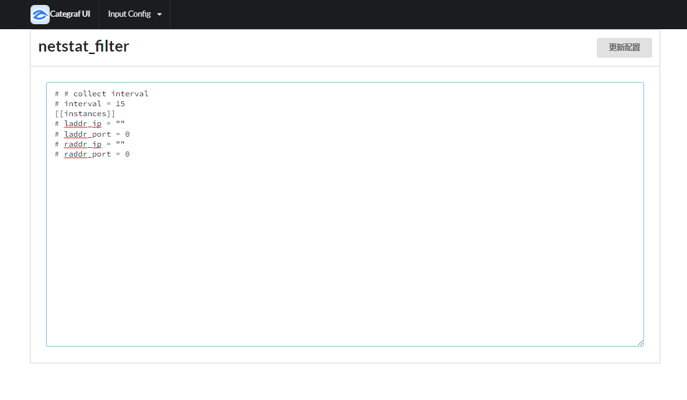

## Categraf UI
通过UI管理categraf配置文件，远程RELOAD,
适用于nightingale v5
##测试地址
http://106.15.233.30/
## 安装

```shell
tar zcvf categraf.tar.gz categraf conf
```

## 配置
```
[http]
enable = true    ##http enable为true
address = ":9100"
print_access = false
run_mode = "release"
```


## 运行
```shell
./categraf

```

## 增加UI编辑配置


